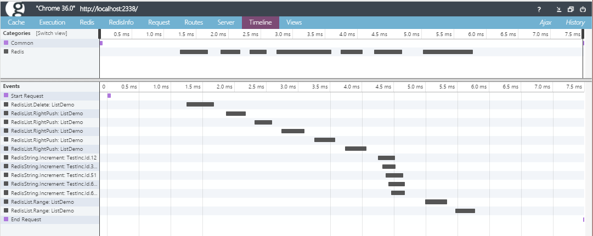
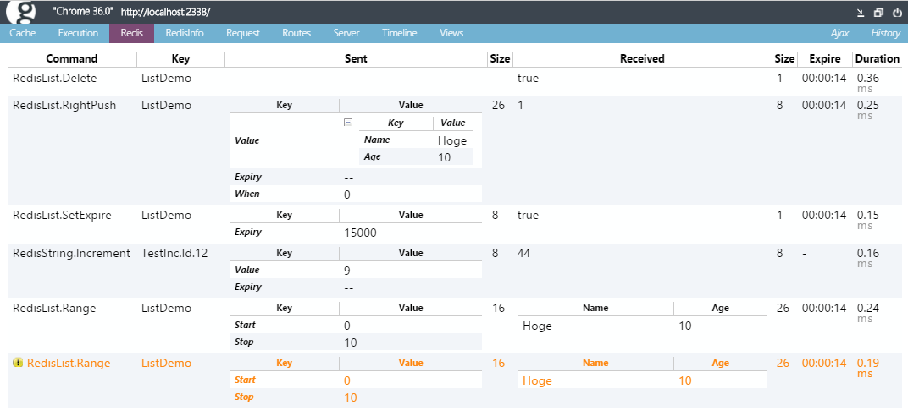
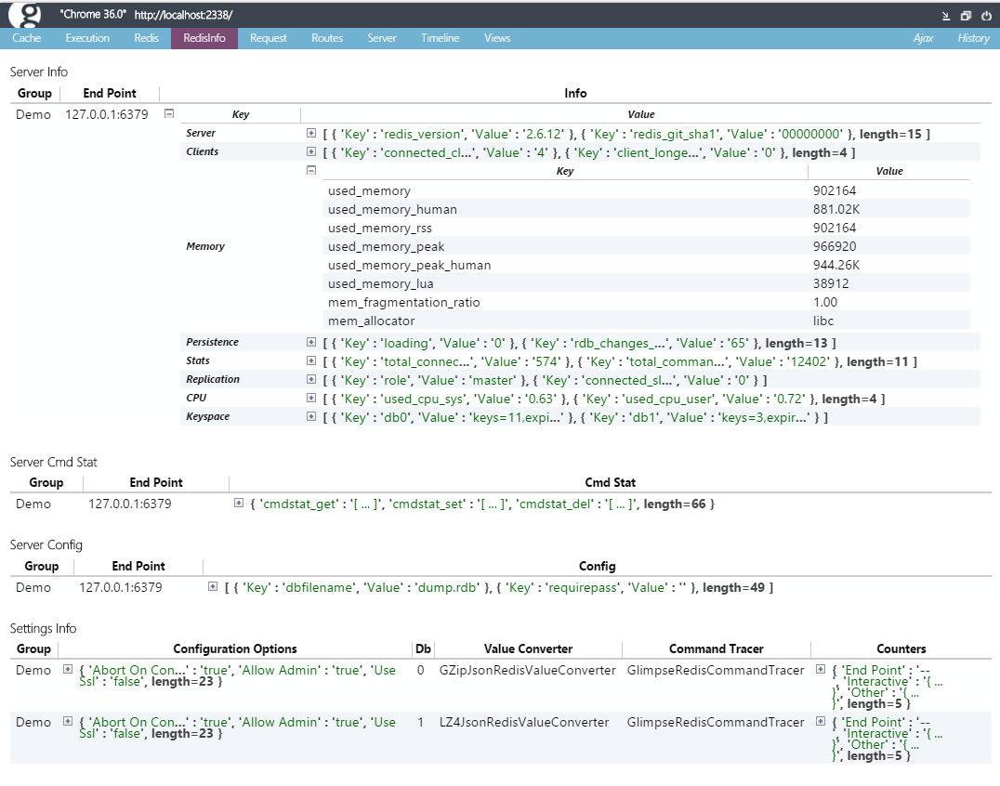

CloudStructures
===============
Redis Client based on [StackExchange.Redis](https://github.com/StackExchange/StackExchange.Redis). CloudStructures appends connection management, auto serialize/deserialize for RedisValue, key distributed connection(sharding), command logging, Web.config supports and Redis Profiler for Glimpse. 

Why use CloudStructures?
---
StackExchange.Redis is pure, low level library. It is Redis driver like ADO.NET. Using raw is very hard. CloudStructures is simple O/R(Object/Redis) Mapper like Dapper in ADO.NET.

Install
---
from NuGet - [CloudStructures](https://nuget.org/packages/CloudStructures/)
```
PM> Install-Package CloudStructures
```

How to use
---
At first, create `RedisSettings` or `RedisGroup` that represents StackExchange.Redis's ConnectionMultiplexer holder and create RedisStructure Class(`RedisString`, `RedisList`, etc). 

```csharp
// Settings should holds in static variable
public static class RedisServer
{
    public static readonly RedisSettings Default = new RedisSettings("127.0.0.1");
}

// a class
public class Person
{
    public string Name { get; set; }
    public int Age { get; set; }
}

// Create RedisString... (or you can use RedisSettings.Default.String<Person>("key"))
var redis = new RedisString<Person>(RedisServer.Default, "test-string-key");

// call command(IntelliSense helps you)
await redis.Set(new Person { Name = "John", Age = 34 });

// get is the same as 
var copy = await redis.Get();

// List is the same as
var list = new RedisList<Person>(RedisServer.Default, "test-list-key");
await list.LeftPush(new[] { new Person { Name = "Tom" }, new Person { Name = "Mary" } });

var persons = await list.Range(0, 10);
```

CloudStructures manage object serialization/deserialization automatically. 

Data structure of Redis
---
CloudStructures supports these Redis data types. All methods are async.

Class  |Description 
-------| -----------
`RedisString<T>`|Redis's Strings API 
`RedisList<T>`|Redis's Lists API
`RedisSet<T>`|Redis's Sets API
`RedisHash<TKey>`|Redis's Hashes API
`RedisDictionary<TKey, TValue>`| Hashes API with constrained value type.
`RedisClass<T>`|C# type mapped Redis Hashes  
`RedisSortedSet<T>`|Redis's SortedSets API
`RedisHyperLogLog<T>`|Redis's HyperLogLog API
`RedisLua`|Lua EVALSHA API

Methods are simply wrapped StackExchange.Redis's API. Data type prefix(String/List/Set/etc) are Class, removed async suffix and RedisValue to T. For example `ListLeftPushAsync(RedisKey, RedisValue)` -> `new RedisList<T>(RedisKey)`.`LeftPush(T)`.

All storing methods have `RedisExpiry` argument. If expiry isn't null which is appended expiry second. RedisExpiry is convert from DateTime/TimeSpan implicitly.

```csharp
var list = new RedisList<int>(settings);
await list.LeftPush(1, expiry: TimeSpan.FromSeconds(30));
await list.LeftPush(10, expiry: DateTime.Now.AddDays(1));
```

And all classes have `Expire`, `Exists`, `Delete`, `TimeToLive`.

Some classes have additional methods. RedisList has `LeftPushAndFixLength` that simulate fixed size list by LPUSH and TRIM. RedisSortedSet has `RangeByRankWithScoresAndRank` that returns value, score and rank. If class has Increment method which is appended `IncrementLimitByMax` and `IncrementLimitByMin` there are increment with max/min limit by custom LUA script.

Some methods return `RedisResult<T>`. If Redis returns null `RedisResult<T>.HasValue` is false. You can take value from `Value` property or `GetValueOrDefault(defaultValue)` method or `GetValueOrNull()` method that if HasValue is false then return null.

```csharp
var redis = new RedisString<int>(settings);
var result = await Get();

// take from .Value
if (result.HasValue) Debug.Write(result.Value);
// or from GetValueOrDefault
var value = result.GetValueOrDefault(-1);
// take boxed value
var objectValue = result.GetValueOrNull();
```

CloudStructures does not provide multiple key operation such as SUNION, ZINTERSTORE, etc. Because connection might be distributed by RedisGroup, secondary key may not exist in first key's Redis. If you want to do it, you can take raw connection and do manual deserialize.

```csharp
// Connections in the group must be single
var rawResults = settings.GetConnection().GetDatabase().SetCombine(SetOperation.Union, "firstKey", "secondKey");
var results = rawResults.Select(x => { long size; return settings.ValueConverter.Deserialize<Person>(x, out size); }).ToArray();
```

Configuration
---
load configuration from web.config or app.config

```xml
<configSections>
    <section name="cloudStructures" type="CloudStructures.CloudStructuresConfigurationSection, CloudStructures" />
</configSections>

<cloudStructures>
    <redis>
        <group name="Cache">
            <!-- Simple Grouping(key sharding) -->
            <add connectionString="127.0.0.1,allowAdmin=true" db="0" />
            <add connectionString="127.0.0.1,allowAdmin=true" db="1" />
        </group>
        <group name="Session">
            <!-- Full option -->
            <add connectionString="127.0.0.1,allowAdmin=true" db="2" valueConverter="CloudStructures.GZipJsonRedisValueConverter, CloudStructures"  commandTracer="Glimpse.CloudStructures.Redis.GlimpseRedisCommandTracer, Glimpse.CloudStructures.Redis" />
        </group>
    </redis>
</cloudStructures>
```

```csharp
// setting hold static fields
public static class RedisGroups
{
    // load from web.config
    static Dictionary<string, RedisGroup> configDict = CloudStructures.CloudStructuresConfigurationSection
        .GetSection()
        .ToRedisGroups()
        .ToDictionary(x => x.GroupName);

    // setup group
    public static readonly RedisGroup Cache = configDict["Cache"];
    public static readonly RedisGroup Session = configDict["Session"];

    static RedisGroups()
    {
        // If you want to enable Glimpse's RedisInfo then register groups
        Glimpse.CloudStructures.Redis.RedisInfoTab.RegisiterConnection(new[] { Cache, Session });
    }
}
```

connectionString is [StackExchange.Redis's Configuration String](https://github.com/StackExchange/StackExchange.Redis/blob/master/Docs/Configuration.md).

ValueConverter
---
Default ValueConverter(Serializer) is JSON by [Jil](https://github.com/kevin-montrose/Jil). You can change ValueConverter on RediSettings's valueConverter property. ClousStructure has 2 compressed valueConverter. One is `GZipJsonRedisValueConverter` it's bundled CloudStructures. Another is `LZ4JsonRedisValueConverter` it's used fastest compression algorithm [LZ4](https://code.google.com/p/lz4/).

Install from NuGet - [CloudStructures.LZ4](https://nuget.org/packages/CloudStructures.LZ4/)

```
PM> Install-Package CloudStructures.LZ4
```

and configuration for

```xml
valueConverter="CloudStructures.LZ4JsonRedisValueConverter, CloudStructures.LZ4"
```

Glimpse.CloudStructures.Redis
---
CloudStructures has Redis Profiler for [Glimpse](http://getglimpse.com/).

Install from NuGet - [Glimpse.CloudStructures.Redis](https://nuget.org/packages/Glimpse.CloudStructures.Redis/)

```
PM> Install-Package Glimpse.CloudStructures.Redis
```

Setup Glimpse and add config with GlimpseRedisCommandTracer. If you use RedisInfoTab then have to set connectionString's allowAdmin = true and regisiter RedisGroup at first.

```xml
<add connectionString="127.0.0.1,allowAdmin=true" db="0" commandTracer="Glimpse.CloudStructures.Redis.GlimpseRedisCommandTracer, Glimpse.CloudStructures.Redis" />
```

```csharp
Glimpse.CloudStructures.Redis.RedisInfoTab.RegisiterConnection(new[] { Cache, Session });
```

Okay, you can see timeline tab, can visualize parallel access.



Look at the RedisTab! You can see Sent/Received object's dump, each size, key expire, command duration, warning at duplicate command & key. 



Finally, RedisInfoTab. Showing all serverinfo, commandstat, server-configuration and client-configuration and client-status-counter.



Author Info
---
Yoshifumi Kawai(a.k.a. neuecc) is software developer in Japan.
He is Director/CTO at Grani, Inc. 
Grani is top social game developer in Japan(and I'm CTO at Grani).  
He awarded Microsoft MVP for Visual C# since 2011.
He is known by creator of [linq.js](http://linqjs.codeplex.com/)(LINQ to Objects for JavaScript) and [UniRx](https://github.com/neuecc/UniRx)(Reactive Extensions for Unity) 

Blog: http://neue.cc/ (JPN)  
Twitter: https://twitter.com/neuecc (JPN)

History
---
2015-10-09 ver 1.1
* improved GetConnection handling(use connectTimeout and retryCount)
* add RedisSettings.OnConnectAsyncFailed
* update NuGet packages(StackExchange.Redis)

2015-05-26 ver 1.1
* fix SoretedSet.Add(IEnumerable) set wrong key
* update NuGet packages(Jil and StackExchange.Redis)

2015-02-11 ver 1.0.1(only CloudStructures.LZ4)
* LZ4JsonRedisValueConverter's default buffer size changed to 64KB

2015-02-06 ver 1.0.0
* changed base library from BookSleeve to StackExchange.Redis
* overhaul all API, many breaking changes
* improvement RedisTab for Glimpse
* add RedisInfoTab for Glimpse
* regsiter CloudStructures.LZ4 on NuGet
* document rewrite

2013-11-16 ver 0.6.1
* fix, Configuration's GetElementKey take uniq by Host, Port, Db.

2013-11-15 ver 0.6.0
* add, Glimpse.CloudStructures.Redis
* improved, connection waitOpen use syncTimeout.
* improved, can monitor RedisConnection event(Open/Close/Error/Shutdown) on RedisSettings.
* fix bugs, List.AddFirstAndFixLength is always trimed right length -1.
* breaking changes, ICommandTracer receive many extra key(settings, sentObject, receivedObject).

License
---
under [MIT License](http://opensource.org/licenses/MIT)
